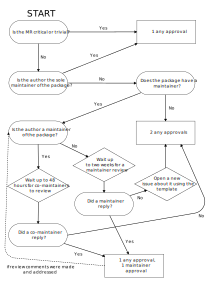

# Approval Rules

pmaports follows the general
[code review and merge](https://docs.postmarketos.org/policies-and-processes/development/code-review-and-merge.html)
rules, but with the following changes.

## Regular MR approvals

Most MRs, those not considered critical or trivial require approval by the
package maintainer, and by another team member with approval and merge
rights. If the author of the merge request is the sole maintainer of a package
it is sufficient to solely have the approval a team member.

If there is no package maintainer or the package maintainer does not
reply within 2 weeks from the time the MR was opened, then any 2 approvals are
required. When you merge a MR with no maintainer response, open a issue with the
issue template: <https://gitlab.postmarketos.org/postmarketOS/pmaports/-/issues/new?description_template=Maintainership_status_of_package>.

If there are multiple maintainers, an approval from any maintainer is sufficient
to satisfy the "approval by the package maintainer" criteria (i.e., not every
maintainer needs to approve it—only one). However, when a maintainer submits a
merge request for a package with multiple maintainers, co-maintainers must be
given a 48-hour review window (starting when they're notified, typically via the
automated GitLab ping). After this window expires, the merge request can proceed
with any 2 approvals from team members. The submitting maintainer may choose to
block the merge request to wait for co-maintainer review beyond the 48-hour
window if desired.

The following flowchart describes the process:

## Move device from category

Moving devices from category is a special operation, see
[device categorization](../packaging/device-categorization).

## Changing kconfigcheck requirements

Changes to `kconfigcheck.toml` are a special operation, see
[kconfigcheck](../packaging/kernel-packages/kconfigcheck).

## Testing requirements

Some MRs require testing due to changes affecting multiple devices. In such
cases, before merging, in addition to the regular approvals, it is required to:

* **edge**: any person in a MR thread confirms that a MR works.
* **stable**: one person from the team confirms that a MR works. On
  device-specific MRs that the team can't test, instead require confirmation of
  device maintainer that it works.

## Stable branches

[MRs to stable branches](./stable-branches) follow the same approval rules as
to the `main` branch.
